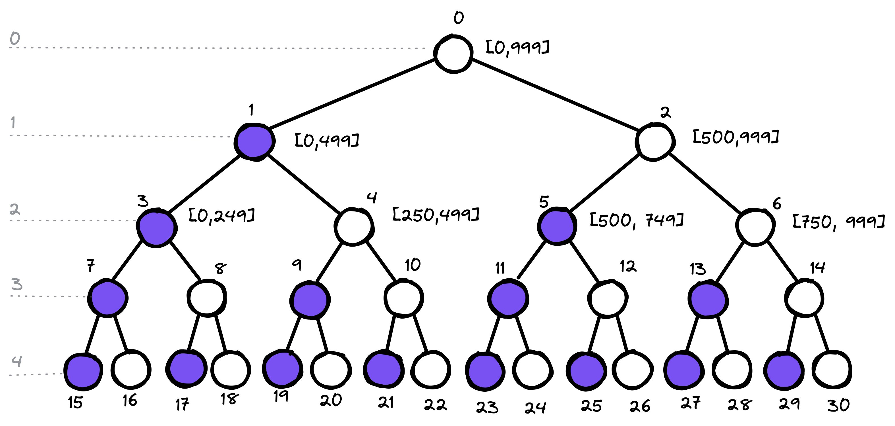

## 31 Oct 2022

### Problem 1

There are 100 closed lockers in a hallway. Behind the lockers are monsters. On
round 1, you go through the lockers and open every single one. On round 2, you
go through the lockers and shut every second. On round 3, you go through the
lockers and toggle every third. On round N, you go through the lockers and
toggle every Nth. After 100 rounds, the monsters will exit the open lockers and
attack. How many monsters will there be attacking you?

Extension 1: Instead of 100 lockers, you now have N lockers and N rounds. Solve
the same problem.

Extension 2: Now, you have N lockers and M rounds, where N and M are not
necessarily the same number. Solve the same problem once more.

### Problem 2

You have 1000 bottles of soda, and exactly one is poisoned. You have 10 test
strips which can be used to detect poison. A single drop of poison will turn the
test strip positive permanently. You can put any number of drops on a test strip
at once and you can reuse a test strip as many times as you'd like (as long as
the results are negative). However, you can only run tests once per day and it
takes seven days to return a result. How would you figure out the poisoned
bottled in as few as possible?

Split the bottles into sets of two as in a binary tree and each day submit test
with sum of one branch of nodes at a level of the tree.

| Day      | Test                    |
| -------- | ----------------------- |
| 0        | 1                       |
| 1        | 3+5                     |
| 2        | 7+9+11+13               |
| 3        | 15+17+19+21+23+25+27+29 |
| $\cdots$ | $\cdots$                |

**Truth Table**

| strip-1  | strip-2  | strip-3  | strip-4  | Result   |
| -------- | -------- | -------- | -------- | -------- |
| T        | T        | T        | T        | 15       |
| T        | T        | T        | F        | 16       |
| T        | T        | F        | T        | 17       |
| T        | T        | F        | F        | 18       |
| T        | F        | T        | T        | 19       |
| T        | F        | T        | F        | 20       |
| T        | F        | F        | T        | 21       |
| T        | F        | F        | F        | 22       |
| $\cdots$ | $\cdots$ | $\cdots$ | $\cdots$ | $\cdots$ |

It takes $n+6$ days to map $2^n$ items. Extending that to our problem, we should
be able to figure out which soda bottle is poisoned in 16 days.

However, if we can submit all test strips in one day, we can get the result in 7
days (the minimum number of days required to get the results).
